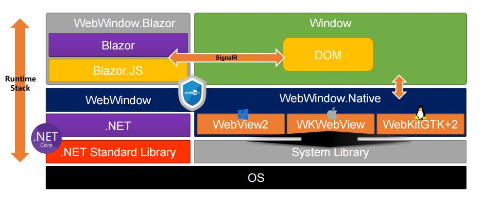
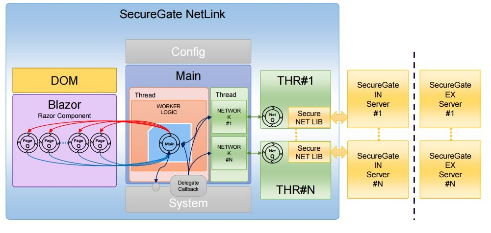

# Open NetLink

크로스 플랫폼 기반의 개방형 OS용 NetLink 개발

## 개발 목표

## Framework Stack 구조

## Open NetLink 구조

## 개발 문서

* [UI 시나리오](https://github.com/hanssak/OpenNetLink/blob/master/docs/NetLink_UI%EC%8B%9C%EB%82%98%EB%A6%AC%EC%98%A4_v1.0.pptx)
* [기능 명세서](https://github.com/hanssak/OpenNetLink/blob/master/docs/NetLink_%EA%B8%B0%EB%8A%A5.%EB%A6%AC%EC%8A%A4%ED%8A%B8.Spec_V1.0.xlsx)
* [기능 상세 명세서](https://github.com/hanssak/OpenNetLink/blob/master/docs/NetLink_%EA%B8%B0%EB%8A%A5%EB%A6%AC%EC%8A%A4%ED%8A%B8_%EC%83%81%EC%84%B8%EC%84%A4%EA%B3%84%EC%84%9C_V1.0.docx)
 
## 개발 표준

 프로젝트 개발 시 개발생산성 향상 및 운영의 효율화를 위해 규칙을 다음과 같이 정의 합니다.

### 1. Coding 원칙
* 주석은 모든 코드에 상세히 기술하는 것을 원칙으로 한다.
* 소스 코드는 불가피한 내용을 제외하고 원칙적으로 중복을 금지한다.
* 소스 코드에서 사용하는 모든 단어는 용어사전의 내용을 기준으로 한다.
* 개발 및 테스트를 수행함에 있어 기능과 성능은 물론 보안에도 각별한 주의를 기울인다.

### 2. Coding Style
코딩 스타일은 소스개발에 대한 규칙을 정의하는 것으로 표준화와 일관성을 확보하는 것을 목적으로 한다.

### 2.1 indent
* indent는 tab을 사용하지 않고, space만 사용한다.
* indent의 크기는 4로 한다.

### 2.2 space
* 한 줄에는 하나의 statement만 기술한다.
* semicolon, comma, 예약어 뒤에는space를 둔다.
* unary operation은 space를 두지 않는다. (ex. i++;)
* binary operation은 양쪽에 space를 둔다. (ex. i = i + 1;)
* 괄호 안에 괄호가 있는 경우에는 괄호 사이에 space를 두지 않는다.

### 2.3 brace
* ‘{’와 ‘}’는 새로운 라인에 기술하며, 다른 내용과 함께 기술하지 않는다. (주석 제외)
* ‘{’는 기존의 ‘{’ 와 비교해서 indent(4-space)를 준다.
* ‘}’는 짝이 되는 ‘{’과 동일하게 indent(4-space)를 준다.
* brace에 주석을 기입하는 경우 ‘//’주석을 사용한다.

### 2.4 용어
* 용어는 원칙적으로 용어사전을 준수하여 용어명에 맞는 영문을 사용한다.
* 하나의 단어를 사용하는 경우에는 용어영문명을 사용한다.
* 여러개의 단어를 조합하여 사용하는 경우에는 영어약어명을 조합해서 사용한다.
* 용어를 사용할 때 동음이의어에 주의한다.
* 사용될 시스템 코드는 다음과 같이 영문 3자로 정의한다.

### 2.5 Logging
* Log는 debug, info, warn, error로 구별하여 사용한다.
* Log는 반드시 발생 시간과 위치 그리고 내용을 포함한다.
* Log는 한 줄만 출력한다.(debug log 제외)
* debug log는 개발자가 개발 시에만 사용하고, 운영 중에는 사용하지 않는다.
* info log는 운영자에게 도움이 될 내용을 기록한다.
* warn log는 error는 아니나 잠재적인 error의 발생이 가능한 내용을 기록한다.
* error log는 error code와 함께 error에 대한 내용을 기록한다.
 
### 2.6 file명명 및 Line
* file이름은 50자를 넘지 않도록 한다.
* file명은 용어사전의 내용을 기준으로 작성하며, 특수기호 및 숫자는 사용하지 않는다.

### 3. UI
* 절대 path 사용을 원칙으로 한다.
* sub-system 이하로 directory는 3-level 이하로 구성한다.
* 파일은 최하위 directory에만 위치한다.
* system명과  sub-system명은 용어 영문명이나 영문약어명의 첫 글자를 조합하여 가능한 3글자로 작성하되 6글자 이하로 작성한다.
* directory에서 사용하는 system명과 sub-system명은 소문자만 사용한다.
